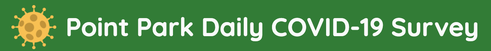
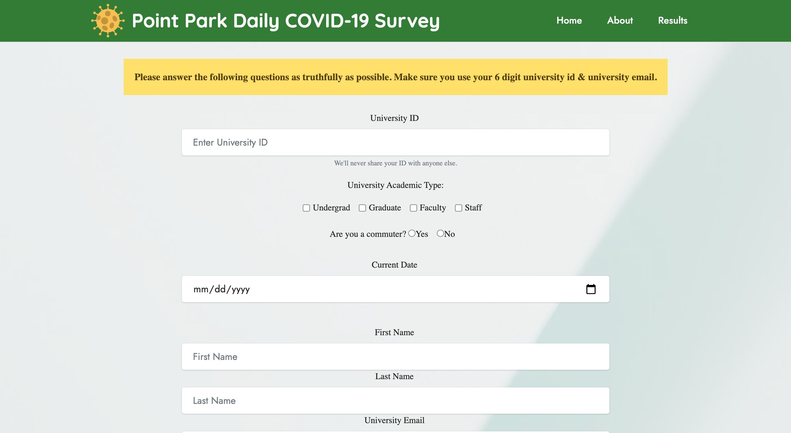
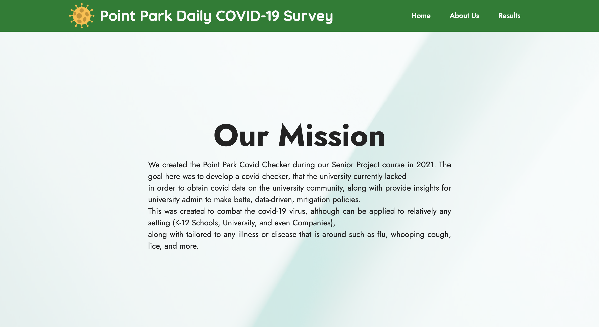
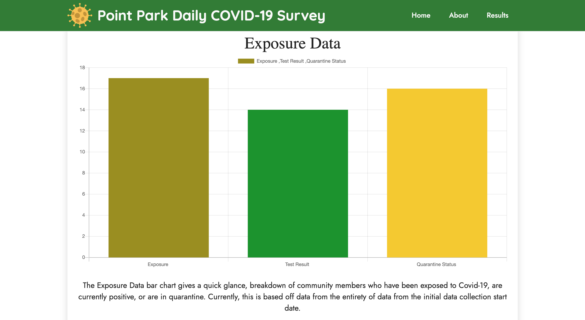

# COVID-Project

Creating an COVID-19 webpage project through data and analytics.

# How did we get started with this initial senior project?
- During the beginning of our semester, we were working building website inspired
by the Pittsburgh university COVID-19 Checker website. From their, we knew Point Park
students, staffs, and faculty would want a survey website that can serve our best interest
in helping our academic members gives information on the latest campus area where people are effected or not from COVID-19  

---
# Business Canvas models
## Key Partners
- Faculty & Staff, Students, University Admin (ie: board, safety officer, etc).
Key Activities Partners Perform
## University Admin would use the data collected to make better policy decisions that impact the community
- Faculty/Staff/Students would input their data daily, along with get to see community data insights.
## Key Activities
- We need data: community members would answer the form daily.

## Distribution Channels
- Options: University Website, Tied to Daily Attendance Tool, Email, and more.
## Key Resources
- The university website, the COVID-19 checker website, and … community data.
## Value Proposition
- This would help put students and staff at the university at ease, helping them know the numbers throughout the community.
- This provides a solution for both community members and admin to submit daily data, along with see data that can make a positive impact on behavior, and illness mitigation.

## Customer Relationships (B2B)
- Acquisition: Making connections to community settings that have the potential need to track illnesses that impact their workforce, attendees, or operations (ie: summer camps, schools, workplaces).
- Retention: Future iterations of this checker would have the ability to change the illness.
1) For example, maybe one season your collecting data on flu, but another could be for lice. Detect outbreaks early, before they impact your organization.
- Grow Sales / Leads:
1) Sales - contract duration extensions through upsells (ex: illness option changes).
2) Leads - Finding new communities arise and identifying needs. (ex: a university may need a checker, but what about their summer camp program they extend to the greater community in the summer, or sports teams, etc).

## Channels
- Direct Sale to B2B
1) Once B2B lead converts to a sale, they get the platform tailored to their illness/color branding, along with unique links to utilize
2) RECOMMENDATION: embed the application via their website
> Admin - get a unique, encrypted link - due to data privacy of community members
>
## Channel Phases
1) Awareness - Sending out a form of community members on the tracker
2) Evaluation - Upon form submission, community members / admin have access to data collection results.
3) Educate- Future enhancement: FAQ sections of data collection method, what is collected, etc.

## Customer Segments
- Community members - students, staff, faulty
- University Admin
## Cost Structure
- Labor
- Data Storage (Warehouse)
- Marketing Expenses to Acquire Leads
- Server
- Data Encryption
## Revenue Stream
- Cost to the B2B to use the application based off timeframe.
>ex): X amount of $ for 6 months.
---

# Use Case

- Data Entry of User Data: 
1) A place for community member to input their daily Covid-19 symptoms, exposure, and factored data
- Data Distribution of the Results:
1) Community Members have access to a results page to view data visualizations of community data results that pertain to them
- Data Distribution for Admin:
1) A way for community admin access to an admin only page to view community data important for community mitigation & policymaking
2) This data is not accessible to non-admin positions

---
## What are list of applications added in this COVID-Project?
### The list of application/languages that can be used:
- jQuery
- JavaScript
- HTML5
- CSS3
- Bootstrap 5
- Node.js
- SQL (through MySQL)
- Chart.js
- NodeMailer
---

## Preview of our website 

## General Overview
- The home page features the PPU COVID-19 self checker survey
- The about page introduce the academics members of this senior project
- The result page is shows visual data analytics displayed and from our backend database
> Admin page is confidential due to private data being collected
>

# Future Iterations

- Email notification upon form submission
- Geographic insights
1) If done ethically
- Enhancements to the Admin.html & Result.html pages
1) Additional charts
>Visual such as a word cloud the utilize symptom data.
2) Different date dimensions
>ex): day, week, month, quarter, etc.

>Date comparison views → EX): Month over Month

